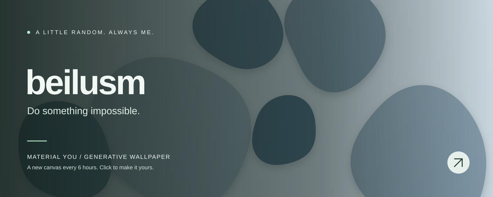

<!-- WALLPAPER:START -->

<b>Organic Pebbles · Deep Ocean</b> 
A new wallpaper every 6 hours · <a href="https://beilusm.github.io/material-you-wallpaper/#wallpaper=WzEsInBlYmJsZXMiLDE2MDAsNjQwLCIjNGE2YjgyIiwiI2UxZWNmNCIsNSw1MywwLjQ2ODE3NTMxMDMzMjQ5MTMsMix0cnVlLHRydWUsMCwxMzMwMDk0MjMyXQ">Edit / download this wallpaper ↗</a> 
Last generated: 2026-11-20 20:09 UTC

<!-- WALLPAPER:END -->

  Turning ideas into reality, and experiments into projects.

Built with curiosity. Painted by code.

